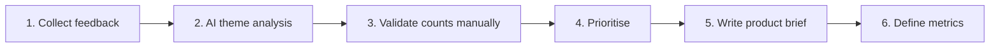
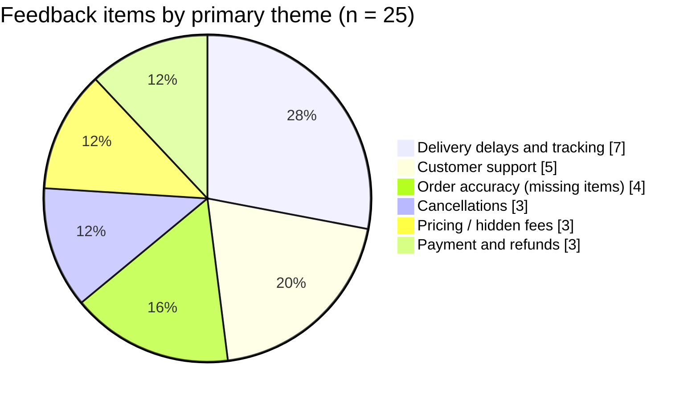

# Product Feedback Analysis: Swiggy (October 2026)

> **Goal:** turn raw user feedback into themes, pain points, prioritised features and success metrics, using AI-assisted analysis with manual validation.

**Role:** Aspiring Product Manager (portfolio project)
**Tools:** Claude, Google Sheets / Notion
**Sample:** 25 user feedback items about Swiggy (see [`data/feedback_25.csv`](data/feedback_25.csv))

---

## The process at a glance



---

## Step 1: Collect user feedback

- Source: Swiggy app reviews (Play Store). **Replace this line with your exact source and date range.**
- 25 items, each saved with a theme tag in [`data/feedback_25.csv`](data/feedback_25.csv).
- Limitations are listed at the bottom, so read them before drawing conclusions.

## Step 2: Cluster feedback into themes with AI

Prompt used (adapt the app name and count):

```text
You are a senior product manager doing user research. Below are 25 user
feedback items about Swiggy.

Give me:
1. THEMES: 5-8 themes with number of mentions and representative examples.
2. PAIN POINTS: one line per theme.
3. SEVERITY: High / Medium / Low, using frequency and whether it blocks the
   core task.
4. FEATURES: one concrete feature or fix per theme.
5. PRIORITY: rank by impact vs effort, with a one-line reason.
6. CAVEATS: bias or limits in this sample.

Output a table: Theme | No. of mentions | Pain point | Suggested feature | Priority
If an item fits two themes, count it in both and say so.
```

## Step 3: Validate the counts manually

AI can miscount, so I re-counted every theme against the raw rows.



## Step 4: Theme table and prioritisation

"Primary" is the main theme tag. "Incl. secondary" also counts items that clearly touch a second theme.

| Theme | Primary | Incl. secondary | Pain point | Suggested feature | Priority |
| --- | --- | --- | --- | --- | --- |
| Delivery delays and ETA/tracking | 7 (#1, 2, 4, 10, 15, 19, 23) | 8 (+#3) | Orders arrive far later than promised and tracking doesn't match reality | Realistic ETAs, proactive delay alerts, rider-assignment status in-app | **High** |
| Customer support | 5 (#6, 7, 11, 18, 22) | 6 (+#16) | Automated replies, slow responses, premature closure, no path to a human | Escalate to a human after 2 failed bot replies, no ticket closure without user confirmation | **High** |
| Order accuracy | 4 (#5, 13, 16, 24) | 4 | Missing or unavailable items, multi-step complaint flow | One-tap missing-item claim, item-availability alert before checkout | **High** |
| Cancellations | 3 (#3, 12, 21) | 5 (+#7, #20) | Cancelled after long waits, fee charged, unclear communication | No fee for restaurant-side cancellations, auto-refund or auto-reorder with reason | **High** |
| Pricing / hidden fees | 3 (#9, 17, 25) | 4 (+#12) | Final bill higher than expected | Full fee breakdown at cart | **Medium** |
| Payment and refund clarity | 3 (#8, 14, 20) | 3 | Confusing status after payment, slow refunds | Payment-confirmed screen, refund tracker with expected date | **Medium** |

**How I prioritised**

- **Frequency:** delivery is the largest theme at 28% (7 of 25).
- **Multiplier effect:** support appears as the failed rescue in cancellation, missing-item and delay stories, so fixing it reduces damage across themes.
- **Financial loss:** cancellation fees and missing items rank High despite lower counts because users lose money.
- **Pricing is Medium** because it affects 3-4 of 25 items and doesn't block the core task (to be checked against star ratings).

## Step 5: Product brief

### 1. Users
Regular urban food-delivery customers who depend on live ETAs and tracking and expect fast recovery when something goes wrong.

### 2. Top 3 problems

| # | Problem | Evidence |
| --- | --- | --- |
| 1 | **Unreliable delivery times.** Orders arrive later than the ETA and tracking doesn't explain why. | 7 of 25 items (28%), including a rider not assigned for a long time (#4) |
| 2 | **Ineffective customer support.** Bot loops, slow replies, tickets closed unresolved. | 6 of 25 items |
| 3 | **Missing or incorrect items.** Direct financial loss, and the claim flow takes too many steps. | 4 of 25 items |

### 3. Recommended features

| Priority | Feature | What it does |
| --- | --- | --- |
| 1 | **Predictive delivery intelligence** | Continuously updated ETAs using prep time, rider availability, traffic and order volume, plus a notification when a delay is likely |
| 2 | **AI support with automatic human escalation** | AI resolves simple issues, escalates unresolved or high-severity cases to a human, and offers clear options (refund, replacement, cancel, agent) |
| 3 | **Dispatch order verification** | Start with a checklist in the restaurant app and in-app availability alerts. Consider scanning only for high-volume partners once data justifies the cost |

### 4. Success metrics

Targets are **assumptions to validate against current baselines**, not facts.

| Feature | Primary KPI | Supporting metrics | Assumed target |
| --- | --- | --- | --- |
| Predictive delivery | % orders delivered within promised ETA | WISMO tickets per 1,000 orders | +15% on-time rate |
| AI support + escalation | Average resolution time | First-contact resolution, repeat-contact rate, support CSAT | -30% resolution time |
| Order verification | Missing/incorrect-item complaint rate | Steps per claim, time to refund | -30% complaints |

### Out of scope (release 2)
Pricing transparency, cancellation fees and refund tracking are real issues in the data, but are deferred so release 1 can focus on reliability.

### Risks
- Conservative ETAs may reduce conversion if the estimate looks too long.
- Auto-escalation increases human support load, so staffing needs to be sized first.
- Dispatch checklists add seconds to restaurant workflow and may face adoption pushback.

### Product recommendation
Ship reliability first: delivery prediction and communication, then support recovery, then missing-item prevention. The goal is to make every order **predictable, transparent and recoverable**.

---

## Limitations (read before citing)

- **Small sample (n = 25)** with no star ratings or dates, so I can't say which issues drive 1-star reviews or whether the sample skews negative.
- **No positive feedback** in the sample, so there is no "what's working" analysis.
- **Items are short summaries**, not verbatim reviews. *[Edit this line to state exactly how they were collected.]*
- Counts are by primary theme, with secondary overlaps shown separately.

## What I'd do next

1. Re-run with 100+ reviews including star ratings and dates.
2. Compare 1-star vs 5-star themes to sharpen severity.
3. Interview 5 users to test the hypotheses behind each feature.
4. Check ETA and support baselines to replace the assumed targets.

## Repo structure

```text
swiggy-feedback-analysis/
├── README.md
└── data/
    └── feedback_25.csv
```

## Author

*Your name* · [LinkedIn](https://linkedin.com/in/your-profile)
